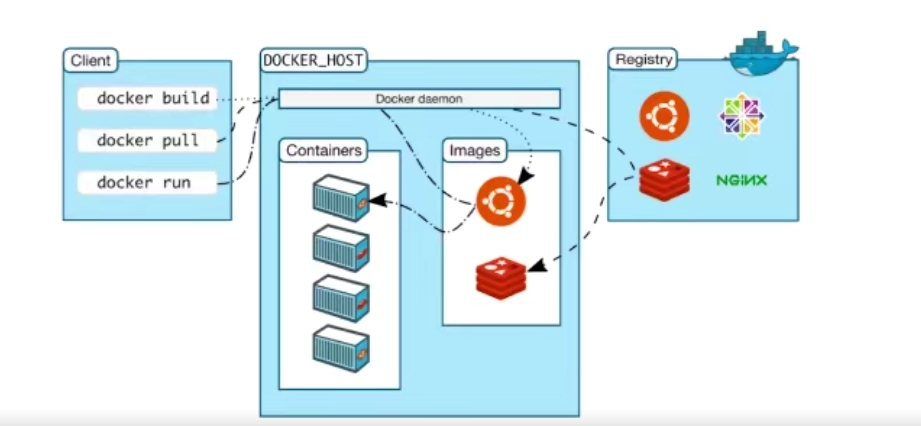
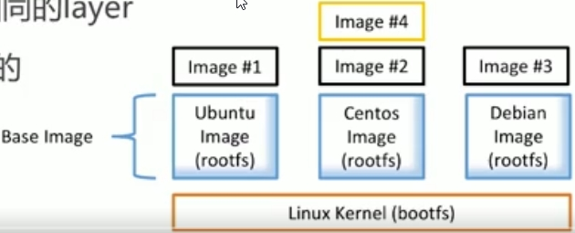
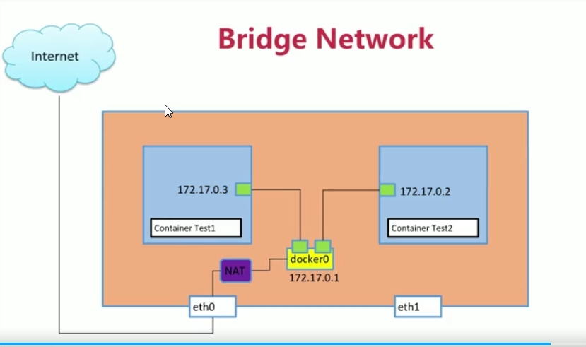
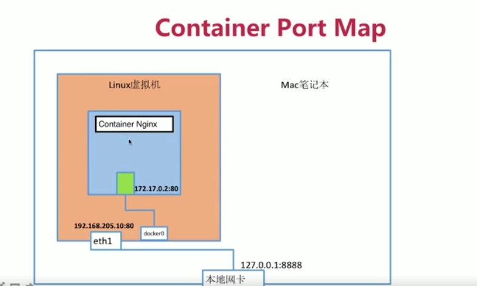
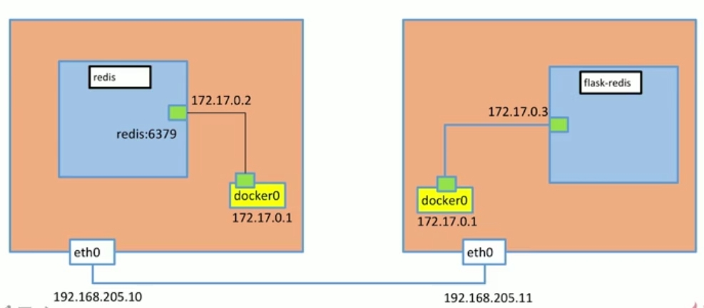
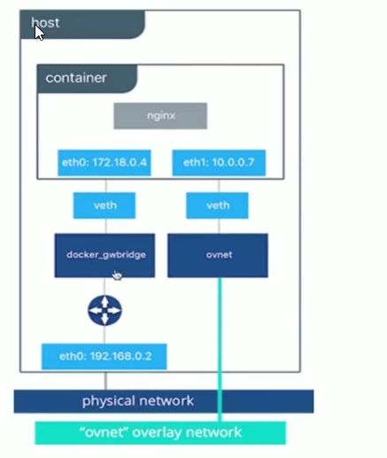
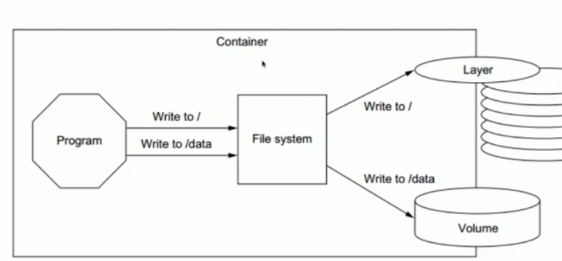

# docker

容器对项目打包，打包以后的容器可以运行在任何的环境中，所有的容器共享一个OS kernal。
提供一个开发，打包，运行app的平台

## 创建虚拟机

VirtualBox会开放一个创建虚拟机的接口，Vagrant会利用这个接口创建虚拟机，并且通过Vagrant来管理，配置和自动安装虚拟机。
在虚拟机中部署好开发环境并建立虚拟机和实体机的文件共享，在开发时，可以通过实体机进行文件修改，并经过虚拟机中的环境执行，从而实现不同操作系统的工作环境的轻松部署。
Vagrantfile的主要功能是描述项目所需的计算机类型

1. vagrant init centos/7 
   通过创建一个初始的Vagrant 文件（如果尚不存在）来初始化当前目录为Vagrant环境
2. vagrant up
   根据Vagrantfile创建和配置计算机

3. vagrant ssh
   进入centos7系统中

## Docker Engine



c/s架构

+ CLI接口--docker  client端
  docker build /pull /run在客户端运行的命令
+ REST API Server  两端进行通信
+ 后台进程 dockerd  server端
  网络，管理镜像，容器，数据存储

底层技术支持 使用的是linux已有的技术

+ namesapces:做每个容器之间相互的隔离，有各自的pid,net,ipc
+ Control groups:容器资源控制
+ Union file systems:Container和image的分层

yarn clean all 清缓存
yarn -y是出现选择都选ok
container.io 与 API进行交互的守护程序
docker-ce 守护程序，负责完成所有的管理程序
docker-ce-cli 控制守护进程的CLI工具
yum list installed | grep docker

sudo yum install -y yum-utils device-mapper-persistent-data lvm2

sudo yum-config-manager \
    --add-repo \
    https://download.docker.com/linux/centos/docker-ce.repo

sudo yum install -y https://download.docker.com/linux/centos/7/x86_64/stable/Packages/containerd.io-1.2.13-3.1.el7.x86_64.rpm

sudo yum install -y  https://download.docker.com/linux/centos/7/x86_64/stable/Packages/docker-ce-selinux-17.03.0.ce-1.el7.centos.noarch.rpm --skip-broken

 sudo yum install -y https://download.docker.com/linux/centos/7/x86_64/stable/Packages/docker-ce-19.03.9-3.el7.x86_64.rpm --skip-broken

sudo yum install -y  https://download.docker.com/linux/centos/7/x86_64/stable/Packages/docker-ce-cli-19.03.8-3.el7.x86_64.rpm

sudo systemctl start docker

## 镜像 Image

所有的镜像都是在Linux Kernel（bootfiles）系统之上创建的，所以其他的镜像就只需要包含rootfs，内存比较小,镜像的原理图



文件和rootfilesystem集合
分层，每一层都可以添加改变删除文件，成为一个新的image
不同的image可以共享相同的layer 

### 制作image

+ 创建docker组
   sudo groupadd docker
   sudo gpasswd -a $USER docker 
   newgrp docker 

+ image发布
  镜像名必须是 **dockerID/镜像名**
  docker push 镜像名

### 私有docker registry

一个容器的内存资源大小有限制，不能超过宿主本身的内存大小。

## 运行的container

交互式的执行 进入到一个容器内部
docker exec -it 容器ID /bin/bash

exit 退出

1. ip地址
docker exec -it 容器ID ip a

2. 停止容器
docker stop 容器ID/容器名

3. 正在运行的容器
docker ps

4. 退出状态的容器
docker ps -a

5. 删除全部容器
docker rm $(docker ps -aq)
docker rm 容器ID
docker rm -f 容器名 #强制删除正在运行的容器
docker image rm 镜像ID

6. 启动容器
将镜像（创建）放入容器中（docker create）,然后将容器启动，使之变成运行时容器（docker start），
docker run -d 容器 进程在后台运行
docker run -d  --name=容器名 容器
docker start 是启动存在的容器，比如已经停止的容器

7. 容器详细信息
docker inspect 容器ID
该容器在运行中产生的日志记录
docker logs 容器ID

+ docker container commit
  
基于某个image创建某个container 对container改变，又可以基于该改变container生成一个新的image
docker commit container名字 新镜像名字

+ docker build
  
从dockerfile生成一个新的image
原理同上，是创建临时的container----image---再将该临时container删除
docker build  -t 新镜像Tag . 基于当前目录下的Dockerfile构建镜像

+ 容器资源限制
内存资源 = memory + memory-swap(默认是与memory大小一样)
--memory=200M 当容器内存资源超过400M时，容器运行报错

--cpu-shares = 5 占用cpu的相对权重
--cpu-shares = 10
则第二个进程的cpu占用率为60% 第一个为40%左右
top实时打印系统资源占用情况

## dockerfile语法

+ FROM
  FORM scratch  #base image
  FROM XXX 使用xxx作为base image 生成新的image
  尽量使用官方的image作为base image

+ LABELM
  定义meta-data 不可少
  LABEL maintainer = 'xxx' #作者
  LABEL version="1.0  #版本
  LABEL description="xxx" #镜像的描述
  
+ RUN
  在base镜像里运行一些命令
  RUN yum update && yum install -y vim \
  python-dev   #反斜线换行
  每run一次都生成新的一层，避免无用分层，合并多条命令成一行
  
+ WORKDIR
  设定当前工作目录 类似cd改变目录 尽量使用绝对目录
  WORKDIR /root 
  WORKDIR /test #如果没有会自动创建test目录

+ ADD 
  将本地文件添加到image里面
  ADD hello / #将hello添加到根目录下
  ADD test.tar.gz / #使用add会将压缩文件解压缩后再放到根目录下
  大部分情况 COPY优于ADD ADD除了COPY还有额外功能（解压）以及创建不存在的目录
  添加远程文件/目录使用curl wget

+ ENV
  ENV MYSQL_VERSION 5.6 设置常量 使用*$MYSQL_VERSION*引用常量
  增加Dockerfile可维护性

+ VOLUME 存储
+ EXPOSE 网络
  
+ CMD
  设置容器**启动后**默认执行的命令和参数
  定义多个cmd只有最后一个会执行
  若docker run -it xxx xxx会使cmd命令忽略，不执行该命令

+ ENTRYPOINT
  设置容器**启动时**运行的命令
  让容器以应用程序或者服务的形式运行，作为后台进程
  不会被忽略，一定会执行

+ 制作命令行工具
   当CMD []为空时，在命令行输入的参数会覆盖CMD
   ENTRYPOINT ["/usr/bin/stress"]
   CMD []
   docker run -it xlx/ubuntu-stress --vm 1 --verbose
   则在容器内部，会运行stress --vm 1 --verbose命令


+ Shell格式
  RUN apt-get install vim
  CMD echo 'hello docker'
  ENTRYPOINT echo "hello docker"

+ Exec 特殊的格式
  RUN ["apt-get","install","-y","vim"]
  CMD ["/bin/echo","hello docker"]
  ENTRYPOINT ["/bin/echo","hello docker"]

## Docker Network

当创建一个容器时，也就创建了一个独立的网络空间，每一个container都有自己一套独立的网络
ip a 查看容器网络 / sudo docker exec 容器名 ip a

两个容器之间是可以互相ping通的
sudo docker network ls docker上有的网络
bridge container都是连接到bridge上
每个容器都通过etc0---veth(docker主机)连接到主机的网络上--默认连接到bridge


单个容器可以访问外网
linux主机通过**eth0**----Internet
docker地址进行NAT网络地址转换

### 创建一个网络

sudo docker network create --d bridge 网络名
sudo docker network ls

1. 容器不存在连接到自定义的网络
docker run -d --name test2 **--network 网络名** busybox /bin/sh -c "while true;do sleep 3600;done"
sudo docker network inspect 网络名可查看详细的网络信息
2. 容器已存在
docker network connect 网路名 容器名
3. 当多个容器连接到同一个自己创建的网路时，可以直接使用**ping容器名**

### namespace

+ 增加容器ns
  sudo ip netns add 空间名
+ 查看空间列表
  sudo ip netns list

 查看空间网络ip
sudo ip netns exec 空间名 ip a

### link

数据库--后台部署
在一个容器中不需要显示知道另一个容器的IP，直接通过容器名就可以ping通
docker run -d --name test2  --link test1 busybox /bin/sh -c "while true;do sleep 3600;done"
--link test1 给test2添加了一个test1的dns的记录

### 端口映射

将容器里的80端口映射到本地Linux虚拟机（后续可以是服务器）的80端口
sudo docker run -d --name web  -p 80:80 nginx


### 添加环境变量

在container中创建了一个REDIS_HOST的环境变量
sudo docker run -d --name redis r -e REDIS_HOST = redis
env 查看环境变量

### 多机器通信

sudo docker network create -d overlay 网络名
sudo docker run -d --name 容器名 -net 网络名 容器名

A主机的容器要访问另一台主机B的容器
将A容器的访问作为A主机的数据包发送给主机B  隧道技术--VXLAN 

overlay 容器的自身的数据
underlay 底层的隧道，基础网络




使用分布式的etcd保证两个容器的ip不能一样(它限制了所在节点容器获得的IP范围)
当在一个docker上创建一个overlay的网络时，另一个docker主机也会产生相同的overlay网络，同时会产生一个docker_gwbridge的一个桥接网络，负责对外通信。容器会有两个ip地址，一个连接到bridge，一个连接到overlay。
当在不同的主机上创建docker容器并连接到overlay网络时，etcd会产生路由键值对(包含两个docker容器的本地ip地址)，在overlay中，会包含两个容器的overlay的IP地址。
分布式网络，则在一个主机的容器内部可以ping另一个容器的IP地址
也可以通过直接ping容器名。


## docker 持久化与数据共享

镜像是只读的，创建的容器是一个临时的存储地方，在容器内部创建的数据，文件写到layer层随着容器的删除而被删除吗，不会改变镜像的内部。

数据持久化则是写到Volume中

+ 基于本地文件系统的Volume
  在执行**Docker create Docker run**时，通过<big>-v</big> 参数将主机的目录作为容器的数据卷。

  **data volume**

  ```js
    //给挂载volume的容器起一个别名
    sudo docker run -d  -v mysql:/var/bin/mysql --name mysql1 -e MYSQL_ALLOW_EMPTY_PASSWORD=true mysql
    // 当再次创建一个容器想要使用该volume时,直接-v volume名
    sudo docker run -d  -v mysql:/var/bin/mysql --name mysql1 -e MYSQL_ALLOW_EMPTY_PASSWORD=true mysql
  ```

  Dockerfile时，通过VOLUME指定持久化的保存路径
  VOLUME ["/var/lib/mysql"]
  docker run -v mysql:/var/bin/mysql指定名字

  **Bind Mounting**
  目录文件同步 将本地目录下的文件与容器内部的文件做映射，一个增删改另一个也会增删改
  $(pwd)获取到本地的当前目录
  docker run -v /home/xzx:/root/xzx 


+ 基于plugin的Volume,支持第三方的存储



## docker compose

基于docker的一个工具，可以通过一个yml文件定义多容器的docker应用（开发环境下）
通过一条命令可以根据yuml文件的定义去创建或者管理多个容器
只支持单机

yum文件格式
docker-compose.yml

+ Services
  一个service代表一个container,这个container可以从dockerhub的image来创建，或者从本地的Dockerfile build出来的image来创建。
  service的启动类似docker run,可以指定network和volume,

  ```js
  services:
     worker: #容器的名字
        build:./worker #构建容器的Dockerfile的目录
        links: #是--link参数
          - db
          - redis
        networks:
          - back-tier


  services:
      db: #容器的名字
        image:#镜像名字
        volumes:
           - "db-data:/var/lib/mysql"
        networks:
           - back-tier
  ```

+ Networks
  
  ```js
    networks:
        back-tier:
          driver:bridge
  ```

+ Volumes
  
  ```js
    volumes:
       db-data:
    //类似于 docker volume create db-data
  ```


1. 安装docker-compose
sudo curl -L "https://github.com/docker/compose/releases/download/1.25.5/docker-compose-$(uname -s)-$(uname -m)" -o /usr/local/bin/docker-compose

2. 修改权限
sudo chmod +x /usr/local/bin/docker-compose

3. docker-compose up -d(后台运行，不会产生log)
   让所有的容器启动 自动找docker-compose.yml
   docker-compose -f xxx.yml up启动有其他名字的container
4. docker-compose ps
   列出容器
5. docker-compose stop /down(stop and remove --全部删除，container,image,network)
6. docker-compose start 启动container\
7. docker-compose images 镜像
8. docker-compose exec service名 bash
9. scale 扩展容器数量，方便进行负载均衡
  docker-compose up --scale 容器名（.yml文件中的容器名）=容器数量
10. docker-compose build
  如果.yml文件中含有需要build的镜像，则可以先使用build再使用up 速度会快一些
  
## 安装过程报错

1. 解析ip不可用
   yum install bind-utils
   dig @114.114.114.114 registry-1.docker.io
   vi /etc/hosts
   34.199.77.19 registry-1.docker.io
   systemctl restart docker

2. 修改镜像源
   sudo vi /etc/docker/daemon.json
   {
    "registry-mirrors": ["https://registry.docker-cn.com","http://hub-mirror.c.163.com","https://yc89ks0c.mirror.aliyuncs.com"]
   }
   sudo systemctl restart docker.service

3. vagrant与本地共享文件夹
   vagrant plugin install vagrant-vbguest

4. 启动一个容器，自动停止 开启死循环
docker run -d --name test1 busybox /bin/sh -c "while true;do sleep 3600;done"

5. 本地复制文件到vagrant中 插件系统
   vagrant plugin install vagrant-scp
   vagrant scp ../labs docker-node1:/home/chapter5

