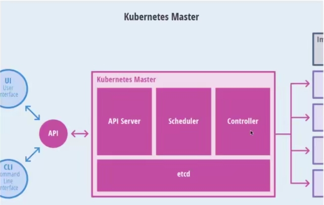
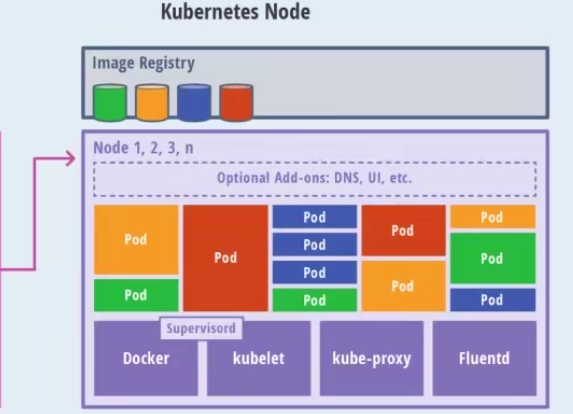

# k8s基础

## Master

+ API Server
  CLI/UI与集群交互
+ Scheduler
  调度模块，决定运行在哪一个节点上
+ Controller
  控制模块，负载均衡等
+ etcd
  分布式存储，存储集群的状态和配置


## node

+ Pod
  具有相同networknamespace的container的组合
+ kubelet
  与master通信
+ kubelet-proxy
  与网络有关，端口的暴露，转发，负载均衡
+ fluentd
  日志的采集存储



kubelet:运行在cluster所有节点上,负责启动POD和容器
kubeadm:用于初始化cluster
kubectl:kubectl是kubenetes命令行工具，通过kubectl可以部署和管理应用，查看各种资源，创建，删除和更新组件


Centos8 安装k8s

1. 配置yum镜像源为aliyun
cd /etc/yum.repos.d
sudo wget http://mirrors.aliyun.com/repo/Centos-8.repo
yum clean all
yum makecache

2. 配置kubernetes.repo

```js
sudo vim /etc/yum.repos.d/kubernetes.repo

[kubernetes]
name=Kubernetes Repo
baseurl=https://mirrors.aliyun.com/kubernetes/yum/repos/kubernetes-el7-x86_64/
gpgcheck=0
enabled=1
repo_gpgcheck=1
gpgkey=https://mirrors.aliyun.com/kubernetes/yum/doc/yum-key.gpg https://mirrors.aliyun.com/kubernetes/yum/doc/rpm-package-key.gpg

禁用防火墙
sudo systemctl disable firewalld

关闭防火墙
sudo systemctl stop firewalld

禁用 SELinux，目的是让容器可以读取主机文件系统

vi /etc/sysconfig/selinux
修改 SELINUX 为 disabled
SELINUX=disabled

sudo setenforce 0
sudo sed -i 's/^SELINUX=enforcing$/SELINUX=permissive/' /etc/selinux/config
swapoff -a


yum install -y kubelet kubeadm kubectl


systemctl enable docker.service
systemctl enable kubelet.service
```

